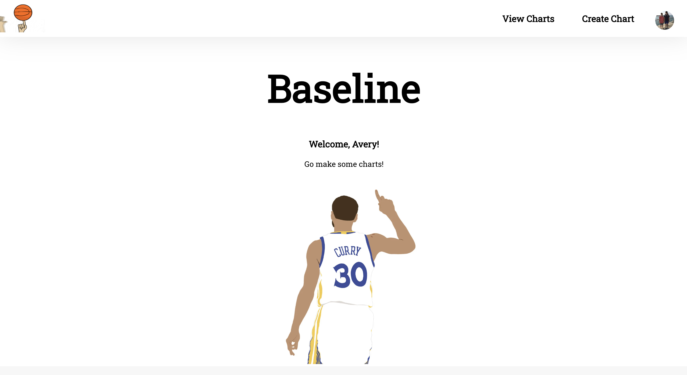
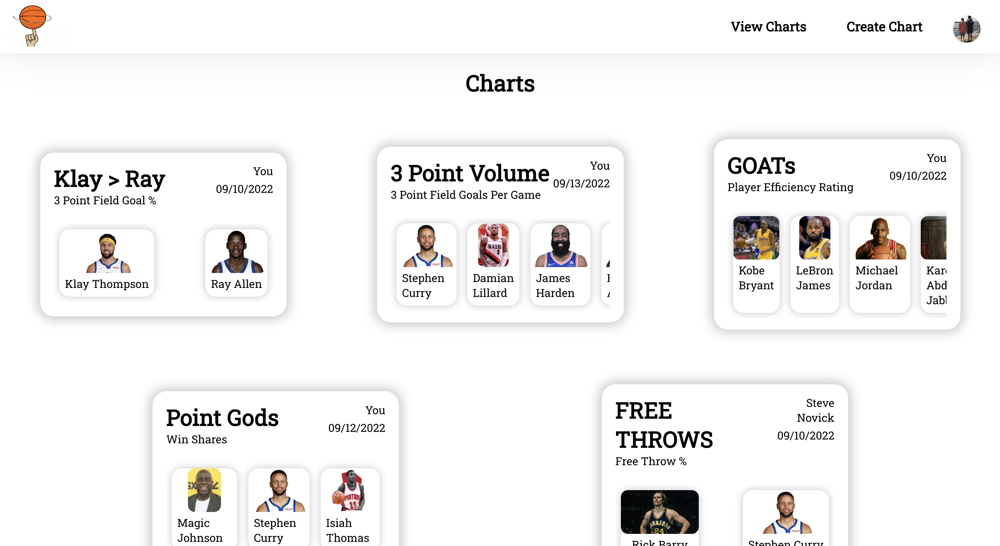
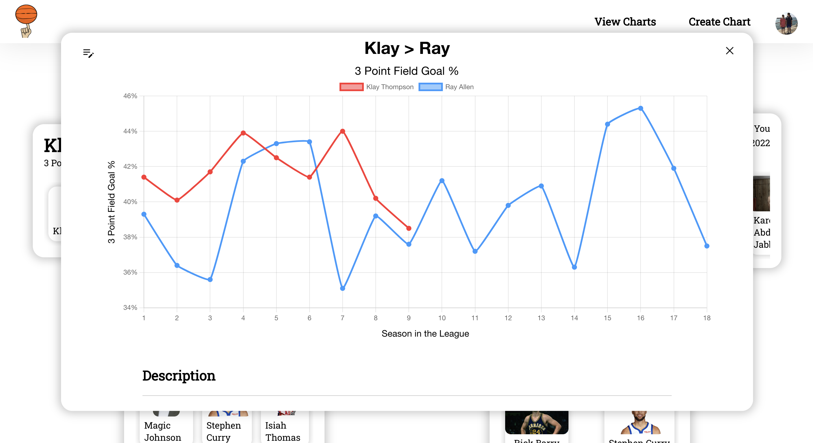
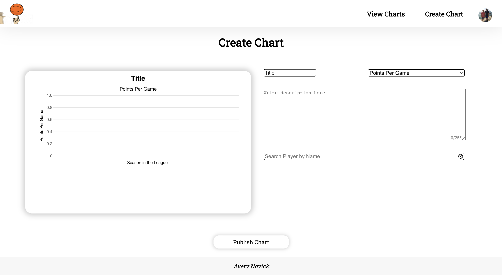
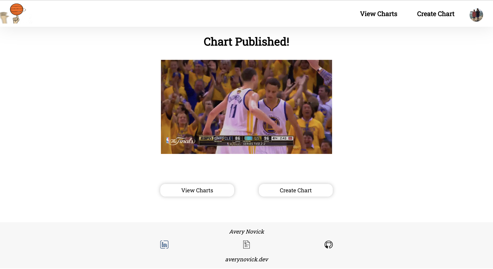
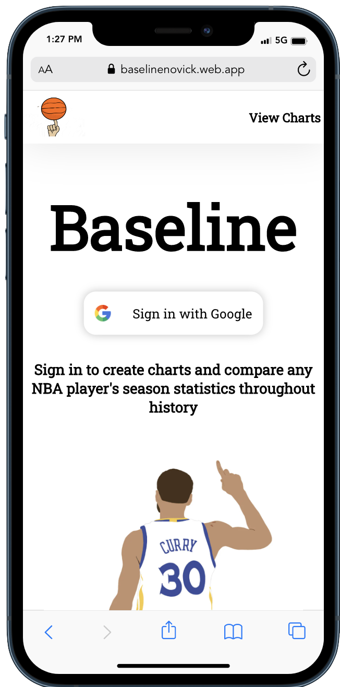
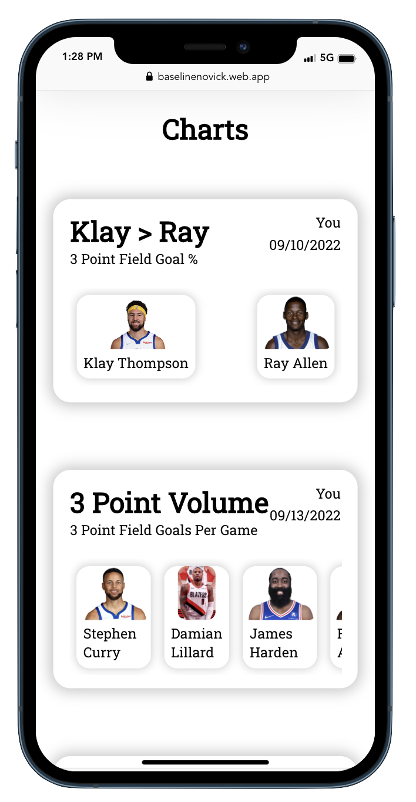
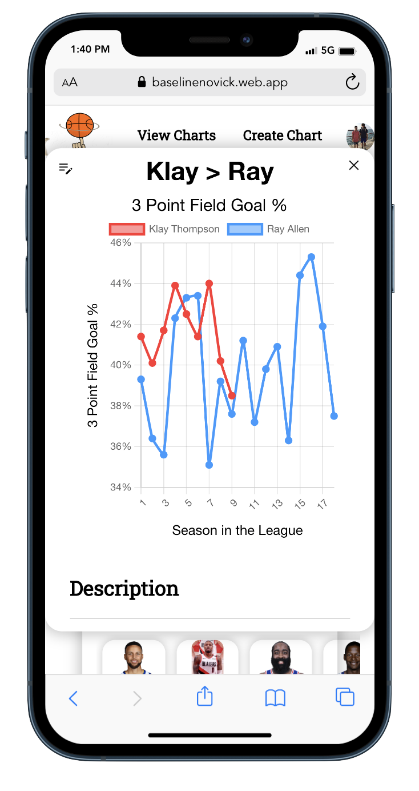
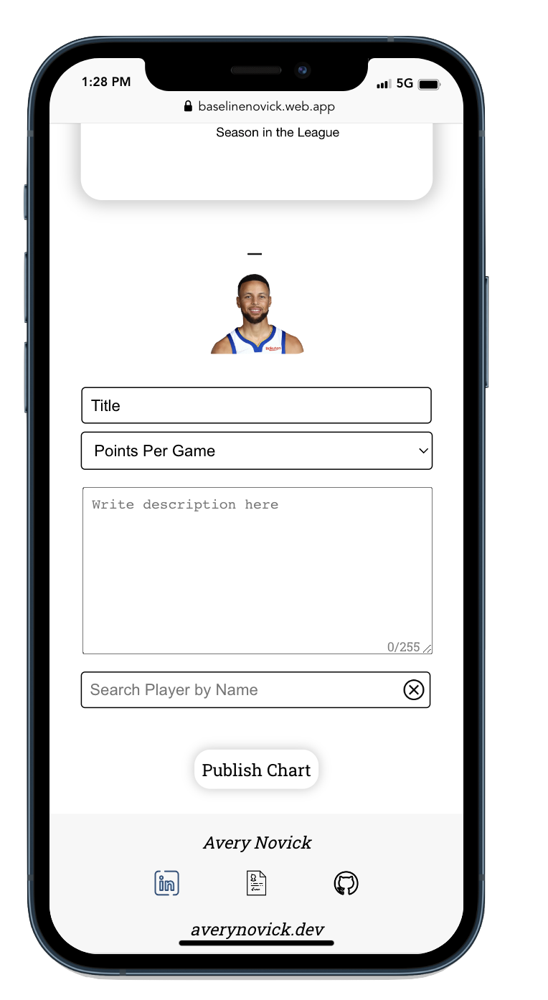
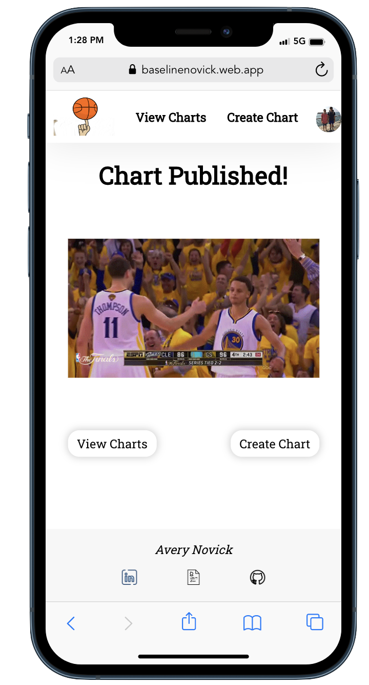

# The Baseline


---

### Date: 09/12/2022

---

#### Avery Novick: <a href="https://www.linkedin.com/in/avery-novick/" target="_blank" rel="noreferrer">LinkedIn</a>, <a href="https://github.com/anovick1" target="_blank" rel="noreferrer">GitHub</a>, <a href="averynovick.dev" target="_blank" rel="noreferrer">Personal Website</a>

---

### <a href="https://baselinenovick.web.app/" target="_blank" rel="noreferrer">Deployed Website</a>

#### <a href="https://github.com/anovick1/Baseline_Backend" target="_blank" rel="noreferrer">Backend Repo</a>

---

## Description

Baseline is a full stack application using PostgreSQL, Django, and Vue. Baseline allows users to create + share graphs about NBA players' season statistics

Currently, there is not a public API that exists that can provide NBA Player statics to the depth that was needed for this project. I used this [NBA Dataset](https://www.kaggle.com/datasets/sumitrodatta/nba-aba-baa-stats?select=Advanced.csv) for all of my data. The authors scraped everything from [Basketball Reference](https://www.basketball-reference.com/). This dataset contains over 50 individual player stats for every player that has played in the NBA since 1947.

I combined the [Player Per Game.csv](https://www.kaggle.com/datasets/sumitrodatta/nba-aba-baa-stats?select=Player+Per+Game.csv) and [Advanced.csv](https://www.kaggle.com/datasets/sumitrodatta/nba-aba-baa-stats?select=Advanced.csv) in my backend to have all the in-depth statistics for users to graph.

I used the [Player Career Info.csv](https://www.kaggle.com/datasets/sumitrodatta/nba-aba-baa-stats?select=Player+Career+Info.csv) to match the stats to specific players. I then wrote a python script that found an image for all 5,024 NBA players and added a new column to my dataset. I used this [Google Image Search API](https://rapidapi.com/Glavier/api/google-image-search1/) to select a picture.

## Getting Started

Once you fork and clone the repo:

```
npm i
```

```
 npm run serve
```

---

## Screenshots

#### Browser Version

<div style= "center">
    <pre>
        &nbsp;&nbsp;&nbsp;&nbsp;&nbsp;&nbsp;&nbsp;&nbsp;&nbsp;&nbsp;&nbsp;&nbsp; &nbsp;&nbsp;&nbsp;
    </pre>
</div>

#### Mobile Version

<div style= "center">
    <pre>
        &nbsp;&nbsp;&nbsp;&nbsp;&nbsp;&nbsp;&nbsp;&nbsp;&nbsp;&nbsp;&nbsp;&nbsp;&nbsp;&nbsp;&nbsp;
    </pre>
</div>

---

## Technologies Used


- Vue.js
- PostgresQL
- Django
- Python
- Javascript
- Chart.js
- Kagle
- Pandas
- NumPy
- CSS
- HTML
- Firebase
- Heroku

---

## Future Updates

- [ ] Bar graphs for career averages
- [ ] Team Stats
- [ ] Allow users to make collections of multiple graphs
- [ ] view others' profile

---

### **_Resources_**

#### [NBA Stat Dataset](https://www.kaggle.com/datasets/sumitrodatta/nba-aba-baa-stats?select=Advanced.csv)

##### [Trello Link](https://trello.com/b/8MOoe2VG/baseline)

##### [Transition Groups Link](https://vuejs.org/guide/built-ins/transition-group.html)
